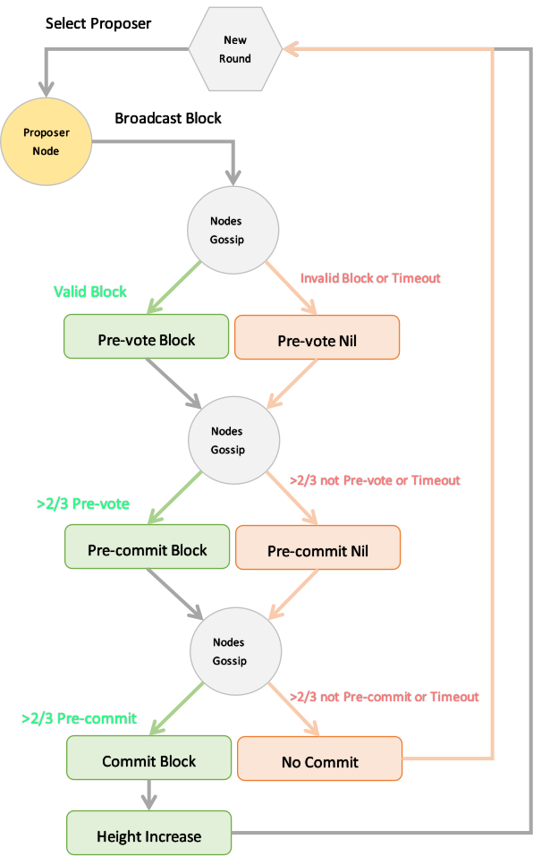
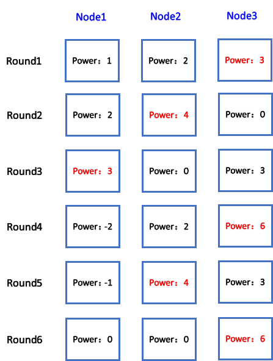

# tendermint 共识协议解析

## Tendermint概述

Tendermint是一个优秀的基于PBFT+POS共识协议的区块链底层框架，已有许多基于tendermint的成熟的实现案例。Tendermint包括两个主要技术组件：区块链共识引擎(Tendermint core)和通用应用程序接口(ABCI)。 共识引擎，保证所有的机器按照相同的顺序记录相同的交易，即底层区块链部分。 应用程序接口，实现任意编程语言处理交易的功能，即将区块链的交易处理开放给上层程序，以便实现自定义的功能。

## Tendermint共识概述

Tendermint共识采用了tendermint BFT+POS的联合共识协议。tendermint BFT用于所有节点对区块完成过程达成共识，POS用于从众多节点验证者（Validators）中选出当前区块的提案者（proposer）。

PBFT (Practical Byzantine Fault Tolerance, 实用拜占庭容错) 是联盟链采用的一种共识算法，该算法在实际应用中可以解决拜占庭问题，有1/3的容错性。tendermint BFT协议为tendermint core采用的一种PBFT算法的变种，它在区块链基础上加了投票锁机制，取代了PBFT复杂低效的view-change流程，提高了共识性能。

POS（Proof of stake, 股权证明）是一种高效的半去中心化的共识算法，该算法在牺牲完全去中心化的基础上，大大提高了共识性能，与商业应用更为契合。Tendermint采用POS算法来赋予各个不同节点验证者不同的投票权重，并按照权重的大小选出当前出块的提案者。

## tendermint BFT共识流程

tendermint的共识过程主要分为Proposal，Pre-vote，Pre-commit，Commit四个过程。

##### 1.提案Proposal

每一轮进入出块阶段（New Round），tendermint会从按照POS权重大小从众多验证者中选出当前的区块提案者（Proposer），提案者从自己的交易池总获取已验证的合法交易valid-transaction，打包成新的区块，并将新区块的提案消息广播给所有连接的其他节点。

##### 2.预投票Pre-vote

所有收到区块提案的节点，会对区块内的交易内容进行验证，若区块验证成功则该验证者节点对该提案发起预投票并广播给其他节点并进入下一轮，若对区块验证失败或者超时，直接进入下一轮。

##### 3.预提交Pre-commit

所有节点接收其他节点对当前区块提案的的预投票消息，当达到2/3权重及以上时，该节点对外广播预提交消息并进入下一轮。若该节点在等待预投票消息不够2/3权重而超时，直接进入下一轮。

##### 4.区块提交Commit

所有节点接收其他节点对当前区块提案的的预提交消息，当达到2/3权重及以上时，该节点提交提案的区块到本地数据库并执行区块内的交易，然后区块高度加1，进入新一轮的出块流程。若接收的预提交消息不到2/3而超时，节点区块高度不变，重新进入新一轮流程。

附：tendermint达成区块共识的 BFT 流程图



## BFT共识流程源码简析

##### 代码中的共识阶段

```go
const (
  RoundStepNewHeight   = RoundStepType(0x01) // Wait til CommitTime + timeoutCommit               新区块高度
  RoundStepNewRound   = RoundStepType(0x02) // Setup new round and go to RoundStepPropose         新一轮流程 
  RoundStepPropose    = RoundStepType(0x03) // Did propose, gossip proposal                       提案
  RoundStepPrevote    = RoundStepType(0x04) // Did prevote, gossip prevotes                       预投票
  RoundStepPrevoteWait  = RoundStepType(0x05) // Did receive any +2/3 prevotes, start timeout     等待预投票消息
  RoundStepPrecommit   = RoundStepType(0x06) // Did precommit, gossip precommits                  预提交 
  RoundStepPrecommitWait = RoundStepType(0x07) // Did receive any +2/3 precommits, start timeout  等待预提交消息
  RoundStepCommit    = RoundStepType(0x08) // Entered commit state machine                        提交区块
  // NOTE: RoundStepNewHeight acts as RoundStepCommitWait.
)
```

##### 各阶段的定时器(对应图中的红色流程)

```go
func (cs *ConsensusState) handleTimeout(ti timeoutInfo, rs cstypes.RoundState) {
	cs.Logger.Debug("Received tock", "timeout", ti.Duration, "height", ti.Height, "round", ti.Round, "step", ti.Step)

	// timeouts must be for current height, round, step
	if ti.Height != rs.Height || ti.Round < rs.Round || (ti.Round == rs.Round && ti.Step < rs.Step) {
		cs.Logger.Debug("Ignoring tock because we're ahead", "height", rs.Height, "round", rs.Round, "step", rs.Step)
		return
	}
	// the timeout will now cause a state transition
	cs.mtx.Lock()
	defer cs.mtx.Unlock()

	switch ti.Step {
	case cstypes.RoundStepNewHeight:
		// NewRound event fired from enterNewRound.
		// XXX: should we fire timeout here (for timeout commit)?
		cs.enterNewRound(ti.Height, 0)                            //计时器新高度NewHeight超时，进入新一轮NewRound
	case cstypes.RoundStepNewRound:
		cs.enterPropose(ti.Height, 0)                             //计时器新一轮NewRound超时，进入提案阶段Propose
	case cstypes.RoundStepPropose:
		cs.eventBus.PublishEventTimeoutPropose(cs.RoundStateEvent())
		cs.enterPrevote(ti.Height, ti.Round)                      //计时器提案Propose阶段超时，进入预投票Prevote阶段
	case cstypes.RoundStepPrevoteWait:
		cs.eventBus.PublishEventTimeoutWait(cs.RoundStateEvent())
		cs.enterPrecommit(ti.Height, ti.Round)                    //计时器等待预投票Prevote阶段超时，进入预提交Precommit阶段
	case cstypes.RoundStepPrecommitWait:
		cs.eventBus.PublishEventTimeoutWait(cs.RoundStateEvent())
		cs.enterNewRound(ti.Height, ti.Round+1)                   //计时器等待预提交Precommit阶段超时，进入新一轮NewRound
	default:
		panic(cmn.Fmt("Invalid timeout step: %v", ti.Step))
	}
}
```

##### 新一轮开始enterNewRound

```go
//-----------------------------------------------------------------------------
// State functions
// Used internally by handleTimeout and handleMsg to make state transitions

// Enter: `timeoutNewHeight` by startTime (commitTime+timeoutCommit),
// 	or, if SkipTimeout==true, after receiving all precommits from (height,round-1)
// Enter: `timeoutPrecommits` after any +2/3 precommits from (height,round-1)
// Enter: +2/3 precommits for nil at (height,round-1)
// Enter: +2/3 prevotes any or +2/3 precommits for block or any from (height, round)
// NOTE: cs.StartTime was already set for height.
func (cs *ConsensusState) enterNewRound(height int64, round int) {
	logger := cs.Logger.With("height", height, "round", round)

	if cs.Height != height || round < cs.Round || (cs.Round == round && cs.Step != cstypes.RoundStepNewHeight) {
		logger.Debug(cmn.Fmt("enterNewRound(%v/%v): Invalid args. Current step: %v/%v/%v", height, round, cs.Height, cs.Round, cs.Step))
		return
	}

	if now := time.Now(); cs.StartTime.After(now) {
		logger.Info("Need to set a buffer and log message here for sanity.", "startTime", cs.StartTime, "now", now)
	}

	logger.Info(cmn.Fmt("enterNewRound(%v/%v). Current: %v/%v/%v", height, round, cs.Height, cs.Round, cs.Step))

	// Increment validators if necessary     更新验证者累计权重
	validators := cs.Validators
	if cs.Round < round {
		validators = validators.Copy()
		validators.IncrementAccum(round - cs.Round)
	}

	// Setup new round
	// we don't fire newStep for this step,
	// but we fire an event, so update the round step first   更新验证者列表
	cs.updateRoundStep(round, cstypes.RoundStepNewRound)
	cs.Validators = validators
	if round == 0 {
		// We've already reset these upon new height,
		// and meanwhile we might have received a proposal
		// for round 0.
	} else {
		logger.Info("Resetting Proposal info")
		cs.Proposal = nil
		cs.ProposalBlock = nil
		cs.ProposalBlockParts = nil
	}
	cs.Votes.SetRound(round + 1) // also track next round (round+1) to allow round-skipping

	cs.eventBus.PublishEventNewRound(cs.RoundStateEvent())
	cs.metrics.Rounds.Set(float64(round))

	// Wait for txs to be available in the mempool
	// before we enterPropose in round 0. If the last block changed the app hash,
	// we may need an empty "proof" block, and enterPropose immediately.
    // 这里提案出块有三种方式，可在配置文件修改：1.直接进入提案阶段出块 2.必须收到上链交易才出块 3.设定等待时间，在时间范围内有没有新的上链交易，都会进入提案阶段，出块
	waitForTxs := cs.config.WaitForTxs() && round == 0 && !cs.needProofBlock(height)
	if waitForTxs {
		if cs.config.CreateEmptyBlocksInterval > 0 {
			cs.scheduleTimeout(cs.config.EmptyBlocksInterval(), height, round, cstypes.RoundStepNewRound)  //等待新的交易tx并设定间隔出块定时器，意思是在该时间范围内若没有新的交易tx上链，也会出一个空区块
		}
		go cs.proposalHeartbeat(height, round)  //一直等待新的上链交易tx，然后进入提案阶段，打包交易出块
	} else {
		cs.enterPropose(height, round)     //直接进入提案阶段，出块
	}
}
```

##### 进入提案阶段enterPropose

```go
// Enter (CreateEmptyBlocks): from enterNewRound(height,round)
// Enter (CreateEmptyBlocks, CreateEmptyBlocksInterval > 0 ): after enterNewRound(height,round), after timeout of CreateEmptyBlocksInterval
// Enter (!CreateEmptyBlocks) : after enterNewRound(height,round), once txs are in the mempool
func (cs *ConsensusState) enterPropose(height int64, round int) {
	logger := cs.Logger.With("height", height, "round", round)

	if cs.Height != height || round < cs.Round || (cs.Round == round && cstypes.RoundStepPropose <= cs.Step) {
		logger.Debug(cmn.Fmt("enterPropose(%v/%v): Invalid args. Current step: %v/%v/%v", height, round, cs.Height, cs.Round, cs.Step))
		return
	}
	logger.Info(cmn.Fmt("enterPropose(%v/%v). Current: %v/%v/%v", height, round, cs.Height, cs.Round, cs.Step))

	defer func() {
		// Done enterPropose:
		cs.updateRoundStep(round, cstypes.RoundStepPropose)
		cs.newStep()

		// If we have the whole proposal + POL, then goto Prevote now.
		// else, we'll enterPrevote when the rest of the proposal is received (in AddProposalBlockPart),
		// or else after timeoutPropose
        // 提案完成，进入预投票阶段
		if cs.isProposalComplete() {
			cs.enterPrevote(height, cs.Round)
		}
	}()

	// If we don't get the proposal and all block parts quick enough, enterPrevote
	cs.scheduleTimeout(cs.config.Propose(round), height, round, cstypes.RoundStepPropose)

	// Nothing more to do if we're not a validator
	if cs.privValidator == nil {
		logger.Debug("This node is not a validator")
		return
	}

	// if not a validator, we're done
	if !cs.Validators.HasAddress(cs.privValidator.GetAddress()) {
		logger.Debug("This node is not a validator", "addr", cs.privValidator.GetAddress(), "vals", cs.Validators)
		return
	}
	logger.Debug("This node is a validator")

    //判断自己是否是当前选举出来的提案者，若自己是提案者，开始提案出块decideProposal，若不是也会打印当前提案者的消息
	if cs.isProposer() {
		logger.Info("enterPropose: Our turn to propose", "proposer", cs.Validators.GetProposer().Address, "privValidator", cs.privValidator)
		cs.decideProposal(height, round)
	} else {
		logger.Info("enterPropose: Not our turn to propose", "proposer", cs.Validators.GetProposer().Address, "privValidator", cs.privValidator)
	}
}
```

##### 进入预投票阶段enterPrevote

```go
// Enter: `timeoutPropose` after entering Propose.
// Enter: proposal block and POL is ready.
// Enter: any +2/3 prevotes for future round.
// Prevote for LockedBlock if we're locked, or ProposalBlock if valid.
// Otherwise vote nil.
func (cs *ConsensusState) enterPrevote(height int64, round int) {
	if cs.Height != height || round < cs.Round || (cs.Round == round && cstypes.RoundStepPrevote <= cs.Step) {
		cs.Logger.Debug(cmn.Fmt("enterPrevote(%v/%v): Invalid args. Current step: %v/%v/%v", height, round, cs.Height, cs.Round, cs.Step))
		return
	}

	defer func() {
		// Done enterPrevote:   
		cs.updateRoundStep(round, cstypes.RoundStepPrevote)
		cs.newStep()
	}()

	// fire event for how we got here
	if cs.isProposalComplete() {
		cs.eventBus.PublishEventCompleteProposal(cs.RoundStateEvent())
	} else {
		// we received +2/3 prevotes for a future round
		// TODO: catchup event?
	}

	cs.Logger.Info(cmn.Fmt("enterPrevote(%v/%v). Current: %v/%v/%v", height, round, cs.Height, cs.Round, cs.Step))

	// Sign and broadcast vote as necessary
    // 对提案预投票并广播自己的预投票消息
	cs.doPrevote(height, round)

	// Once `addVote` hits any +2/3 prevotes, we will go to PrevoteWait
	// (so we have more time to try and collect +2/3 prevotes for a single block)
}
```

##### 进入预投票等待阶段enterPrevoteWait

```go
// Enter: any +2/3 prevotes at next round.
func (cs *ConsensusState) enterPrevoteWait(height int64, round int) {
	logger := cs.Logger.With("height", height, "round", round)

	if cs.Height != height || round < cs.Round || (cs.Round == round && cstypes.RoundStepPrevoteWait <= cs.Step) {
		logger.Debug(cmn.Fmt("enterPrevoteWait(%v/%v): Invalid args. Current step: %v/%v/%v", height, round, cs.Height, cs.Round, cs.Step))
		return
	}
	if !cs.Votes.Prevotes(round).HasTwoThirdsAny() {
		cmn.PanicSanity(cmn.Fmt("enterPrevoteWait(%v/%v), but Prevotes does not have any +2/3 votes", height, round))
	}
	logger.Info(cmn.Fmt("enterPrevoteWait(%v/%v). Current: %v/%v/%v", height, round, cs.Height, cs.Round, cs.Step))

	defer func() {
		// Done enterPrevoteWait:
		cs.updateRoundStep(round, cstypes.RoundStepPrevoteWait)
		cs.newStep()
	}()

	// Wait for some more prevotes; enterPrecommit  开始定时器计时，等待更多的预投票，然后进入预提交阶段
	cs.scheduleTimeout(cs.config.Prevote(round), height, round, cstypes.RoundStepPrevoteWait)
}
```

##### 进入预提交阶段enterPrecommit

```go
// Enter: `timeoutPrevote` after any +2/3 prevotes.
// Enter: +2/3 precomits for block or nil.
// Enter: any +2/3 precommits for next round.
// Lock & precommit the ProposalBlock if we have enough prevotes for it (a POL in this round)
// else, unlock an existing lock and precommit nil if +2/3 of prevotes were nil,
// else, precommit nil otherwise.
func (cs *ConsensusState) enterPrecommit(height int64, round int) {
	logger := cs.Logger.With("height", height, "round", round)

	if cs.Height != height || round < cs.Round || (cs.Round == round && cstypes.RoundStepPrecommit <= cs.Step) {
		logger.Debug(cmn.Fmt("enterPrecommit(%v/%v): Invalid args. Current step: %v/%v/%v", height, round, cs.Height, cs.Round, cs.Step))
		return
	}

	logger.Info(cmn.Fmt("enterPrecommit(%v/%v). Current: %v/%v/%v", height, round, cs.Height, cs.Round, cs.Step))

	defer func() {
		// Done enterPrecommit:
		cs.updateRoundStep(round, cstypes.RoundStepPrecommit)
		cs.newStep()
	}()

	// check for a polka
	blockID, ok := cs.Votes.Prevotes(round).TwoThirdsMajority()

	// If we don't have a polka, we must precommit nil.  对非法的区块，预提交投票为nil
	if !ok {
		if cs.LockedBlock != nil {
			logger.Info("enterPrecommit: No +2/3 prevotes during enterPrecommit while we're locked. Precommitting nil")
		} else {
			logger.Info("enterPrecommit: No +2/3 prevotes during enterPrecommit. Precommitting nil.")
		}
		cs.signAddVote(types.VoteTypePrecommit, nil, types.PartSetHeader{})  //
		return
	}

	// At this point +2/3 prevoted for a particular block or nil.
	cs.eventBus.PublishEventPolka(cs.RoundStateEvent())

	// the latest POLRound should be this round.
	polRound, _ := cs.Votes.POLInfo()
	if polRound < round {
		cmn.PanicSanity(cmn.Fmt("This POLRound should be %v but got %", round, polRound))
	}

	// +2/3 prevoted nil. Unlock and precommit nil.  对非法的区块，预提交投票为nil
	if len(blockID.Hash) == 0 {
		if cs.LockedBlock == nil {
			logger.Info("enterPrecommit: +2/3 prevoted for nil.")
		} else {
			logger.Info("enterPrecommit: +2/3 prevoted for nil. Unlocking")
			cs.LockedRound = 0
			cs.LockedBlock = nil
			cs.LockedBlockParts = nil
			cs.eventBus.PublishEventUnlock(cs.RoundStateEvent())
		}
		cs.signAddVote(types.VoteTypePrecommit, nil, types.PartSetHeader{})
		return
	}

	// At this point, +2/3 prevoted for a particular block.

	// If we're already locked on that block, precommit it, and update the LockedRound 对锁定区块解锁，然后进行预提交签名投票
	if cs.LockedBlock.HashesTo(blockID.Hash) {
		logger.Info("enterPrecommit: +2/3 prevoted locked block. Relocking")
		cs.LockedRound = round
		cs.eventBus.PublishEventRelock(cs.RoundStateEvent())
		cs.signAddVote(types.VoteTypePrecommit, blockID.Hash, blockID.PartsHeader)
		return
	}

	// If +2/3 prevoted for proposal block, stage and precommit it  对已达到2/3的预投票的提案区块进行预提交签名投票
	if cs.ProposalBlock.HashesTo(blockID.Hash) {
		logger.Info("enterPrecommit: +2/3 prevoted proposal block. Locking", "hash", blockID.Hash)
		// Validate the block.
		if err := cs.blockExec.ValidateBlock(cs.state, cs.ProposalBlock); err != nil {
			cmn.PanicConsensus(cmn.Fmt("enterPrecommit: +2/3 prevoted for an invalid block: %v", err))
		}
		cs.LockedRound = round
		cs.LockedBlock = cs.ProposalBlock
		cs.LockedBlockParts = cs.ProposalBlockParts
		cs.eventBus.PublishEventLock(cs.RoundStateEvent())
		cs.signAddVote(types.VoteTypePrecommit, blockID.Hash, blockID.PartsHeader)
		return
	}
	.
    .
    .
}
```

##### 进入预提交等待阶段enterPrecommitWait

```go
// Enter: any +2/3 precommits for next round.
func (cs *ConsensusState) enterPrecommitWait(height int64, round int) {
	logger := cs.Logger.With("height", height, "round", round)

	if cs.Height != height || round < cs.Round || (cs.Round == round && cstypes.RoundStepPrecommitWait <= cs.Step) {
		logger.Debug(cmn.Fmt("enterPrecommitWait(%v/%v): Invalid args. Current step: %v/%v/%v", height, round, cs.Height, cs.Round, cs.Step))
		return
	}
	if !cs.Votes.Precommits(round).HasTwoThirdsAny() {
		cmn.PanicSanity(cmn.Fmt("enterPrecommitWait(%v/%v), but Precommits does not have any +2/3 votes", height, round))
	}
	logger.Info(cmn.Fmt("enterPrecommitWait(%v/%v). Current: %v/%v/%v", height, round, cs.Height, cs.Round, cs.Step))

	defer func() {
		// Done enterPrecommitWait:
		cs.updateRoundStep(round, cstypes.RoundStepPrecommitWait)
		cs.newStep()
	}()

	// Wait for some more precommits; enterNewRound   开始定时器计时，等待更多的预提交，然后进入提交阶段
	cs.scheduleTimeout(cs.config.Precommit(round), height, round, cstypes.RoundStepPrecommitWait)

}
```

##### 进入提交阶段enterCommit

```go
// Enter: +2/3 precommits for block
func (cs *ConsensusState) enterCommit(height int64, commitRound int) {
	logger := cs.Logger.With("height", height, "commitRound", commitRound)

	if cs.Height != height || cstypes.RoundStepCommit <= cs.Step {
		logger.Debug(cmn.Fmt("enterCommit(%v/%v): Invalid args. Current step: %v/%v/%v", height, commitRound, cs.Height, cs.Round, cs.Step))
		return
	}
	logger.Info(cmn.Fmt("enterCommit(%v/%v). Current: %v/%v/%v", height, commitRound, cs.Height, cs.Round, cs.Step))

	defer func() {
		// Done enterCommit:
		// keep cs.Round the same, commitRound points to the right Precommits set.
		cs.updateRoundStep(cs.Round, cstypes.RoundStepCommit)
		cs.CommitRound = commitRound
		cs.CommitTime = time.Now()
		cs.newStep()

		// Maybe finalize immediately.   对完成流程的提案区块进行提交
		cs.tryFinalizeCommit(height)
	}()

	blockID, ok := cs.Votes.Precommits(commitRound).TwoThirdsMajority()
	if !ok {
		cmn.PanicSanity("RunActionCommit() expects +2/3 precommits")
	}

	// The Locked* fields no longer matter.
	// Move them over to ProposalBlock if they match the commit hash,
	// otherwise they'll be cleared in updateToState.
	if cs.LockedBlock.HashesTo(blockID.Hash) {
		logger.Info("Commit is for locked block. Set ProposalBlock=LockedBlock", "blockHash", blockID.Hash)
		cs.ProposalBlock = cs.LockedBlock
		cs.ProposalBlockParts = cs.LockedBlockParts
	}

	// If we don't have the block being committed, set up to get it.  当前提交了一个还未收到的区块，将提案的区块置为nil，等待从其他节点同步过来提案的区块
	if !cs.ProposalBlock.HashesTo(blockID.Hash) {
		if !cs.ProposalBlockParts.HasHeader(blockID.PartsHeader) {
			logger.Info("Commit is for a block we don't know about. Set ProposalBlock=nil", "proposal", cs.ProposalBlock.Hash(), "commit", blockID.Hash)
			// We're getting the wrong block.
			// Set up ProposalBlockParts and keep waiting.
			cs.ProposalBlock = nil
			cs.ProposalBlockParts = types.NewPartSetFromHeader(blockID.PartsHeader)
		} else {
			// We just need to keep waiting.
		}
	}
}
```

##### 投票消息处理handleMsg

```go
// state transitions on complete-proposal, 2/3-any, 2/3-one
func (cs *ConsensusState) handleMsg(mi msgInfo) {
	cs.mtx.Lock()
	defer cs.mtx.Unlock()

	var err error
	msg, peerID := mi.Msg, mi.PeerID
	switch msg := msg.(type) {
	.
	.
	.
	case *VoteMessage:
		// attempt to add the vote and dupeout the validator if its a duplicate signature
		// if the vote gives us a 2/3-any or 2/3-one, we transition
		err := cs.tryAddVote(msg.Vote, peerID)  //节点收到投票消息，尝试进行投票
		if err == ErrAddingVote {
			// We probably don't want to stop the peer here. The vote does not
			// necessarily comes from a malicious peer but can be just broadcasted by
			// a typical peer.
			// https://github.com/tendermint/tendermint/issues/1281
		}
	default:
		cs.Logger.Error("Unknown msg type", reflect.TypeOf(msg))
	}
	if err != nil {
		cs.Logger.Error("Error with msg", "height", cs.Height, "round", cs.Round, "type", reflect.TypeOf(msg), "peer", peerID, "err", err, "msg", msg)
	}
}

// Attempt to add the vote. if its a duplicate signature, dupeout the validator
func (cs *ConsensusState) tryAddVote(vote *types.Vote, peerID p2p.ID) error {
	_, err := cs.addVote(vote, peerID)  //节点自己进行投票
	if err != nil {  //若投票出错，则收到的投票消息的轮数round不对，或者报错与发出投票消息的节点投票冲突，保存本地记录，或者自己节点签名出错等
		// If the vote height is off, we'll just ignore it,
		// But if it's a conflicting sig, add it to the cs.evpool.
		// If it's otherwise invalid, punish peer.
		if err == ErrVoteHeightMismatch {
			return err
		} else if voteErr, ok := err.(*types.ErrVoteConflictingVotes); ok {
			if bytes.Equal(vote.ValidatorAddress, cs.privValidator.GetAddress()) {
				cs.Logger.Error("Found conflicting vote from ourselves. Did you unsafe_reset a validator?", "height", vote.Height, "round", vote.Round, "type", vote.Type)
				return err
			}
			cs.evpool.AddEvidence(voteErr.DuplicateVoteEvidence)
			return err
		} else {
			// Probably an invalid signature / Bad peer.
			// Seems this can also err sometimes with "Unexpected step" - perhaps not from a bad peer ?
			cs.Logger.Error("Error attempting to add vote", "err", err)
			return ErrAddingVote
		}
	}
	return nil
}

func (cs *ConsensusState) addVote(vote *types.Vote, peerID p2p.ID) (added bool, err error) {
	cs.Logger.Debug("addVote", "voteHeight", vote.Height, "voteType", vote.Type, "valIndex", vote.ValidatorIndex, "csHeight", cs.Height)

	// A precommit for the previous height?
	// These come in while we wait timeoutCommit  收到之前一个区块的投票消息
	if vote.Height+1 == cs.Height {
		if !(cs.Step == cstypes.RoundStepNewHeight && vote.Type == types.VoteTypePrecommit) {
			// TODO: give the reason ..
			// fmt.Errorf("tryAddVote: Wrong height, not a LastCommit straggler commit.")
			return added, ErrVoteHeightMismatch
		}
		added, err = cs.LastCommit.AddVote(vote)  //给上一次的提交投票
		if !added {
			return added, err
		}
		cs.Logger.Info(cmn.Fmt("Added to lastPrecommits: %v", cs.LastCommit.StringShort()))
		cs.eventBus.PublishEventVote(types.EventDataVote{vote})
		cs.evsw.FireEvent(types.EventVote, vote)

		// if we can skip timeoutCommit and have all the votes now,
		if cs.config.SkipTimeoutCommit && cs.LastCommit.HasAll() {
			// go straight to new round (skip timeout commit)
			// cs.scheduleTimeout(time.Duration(0), cs.Height, 0, cstypes.RoundStepNewHeight)
			cs.enterNewRound(cs.Height, 0)
		}
		return
	}

	// Height mismatch is ignored.
	// Not necessarily a bad peer, but not favourable behaviour.  投票消息的区块高度不匹配，报错返回
	if vote.Height != cs.Height {
		err = ErrVoteHeightMismatch
		cs.Logger.Info("Vote ignored and not added", "voteHeight", vote.Height, "csHeight", cs.Height, "err", err)
		return
	}

	height := cs.Height
	added, err = cs.Votes.AddVote(vote, peerID)  //投票
	if !added {
		// Either duplicate, or error upon cs.Votes.AddByIndex()
		return
	}

	cs.eventBus.PublishEventVote(types.EventDataVote{vote})
	cs.evsw.FireEvent(types.EventVote, vote)

	switch vote.Type {
	case types.VoteTypePrevote: //当前投票消息为预投票
		prevotes := cs.Votes.Prevotes(vote.Round)
		cs.Logger.Info("Added to prevote", "vote", vote, "prevotes", prevotes.StringShort())
		.
        .
        .

		// If +2/3 prevotes for *anything* for this or future round:
		if cs.Round <= vote.Round && prevotes.HasTwoThirdsAny() {
			// Round-skip over to PrevoteWait or goto Precommit.
			cs.enterNewRound(height, vote.Round) // if the vote is ahead of us
			if prevotes.HasTwoThirdsMajority() {
				cs.enterPrecommit(height, vote.Round)  //预投票达到2/3，进入预提交阶段
			} else {
				cs.enterPrevote(height, vote.Round) //预投票未达到2/3, 进入预投票阶段，自己进行投票
				cs.enterPrevoteWait(height, vote.Round) //进入预提交等待阶段
			}
		}
        .
        .
        .

	case types.VoteTypePrecommit:  //当前消息为预提交
		precommits := cs.Votes.Precommits(vote.Round)
		cs.Logger.Info("Added to precommit", "vote", vote, "precommits", precommits.StringShort())
		blockID, ok := precommits.TwoThirdsMajority()
		if ok {
			if len(blockID.Hash) == 0 {
				cs.enterNewRound(height, vote.Round+1)
			} else {
				cs.enterNewRound(height, vote.Round)
				cs.enterPrecommit(height, vote.Round) //预提交达到2/3，进入预提交阶段，自己进行预提交投票
				cs.enterCommit(height, vote.Round) //进入区块提交阶段
                .
                .
                .
			}
		} else if cs.Round <= vote.Round && precommits.HasTwoThirdsAny() {
			cs.enterNewRound(height, vote.Round)
			cs.enterPrecommit(height, vote.Round) //预提交没有达到2/3，进入预提交阶段，自己进行预提交投票
			cs.enterPrecommitWait(height, vote.Round) //进入预提交等待阶段
		}
		.
        .
        .
	}
	return
}
```

## POS共识流程

在一个BFT出块流程之前，tendermint使用POS来从众多验证者里选举出当前round下的提案者。初始时候，每一个节点的投票权重vote-power为创始文件genesis.json里设定的大小。然后每一轮开始，会从验证者中选出最大权重的节点为提案者。下一轮开始时，所有的节点，投票权重自增genesis里设定的大小，而上一轮的提案者则再减去所有节点自增的权重的和。

如下图所示，假定节点node1，node2，node3的投票权重分别为Power1:1，Power2:2，Power3:3。第一轮Round1开始选举出的node3来担任提案者，然后node1的权重累计值为1+Power1，node2的权重累计值为2+Power2，node3的权重累计值为3+Power3-(Power1+Power2+Power3)。在第二轮Round2时，node2选举为提案者。以此类推，六轮出块流程node1，node2，node3的出块几率比为1:2:3和节点权重Power比是一致的。

附：POS选举提案者以及权重变化示意图



## POS源码简析

##### 验证者结构

```go
type Validator struct {
  Address   Address    `json:"address"`
  PubKey   crypto.PubKey `json:"pub_key"`
  VotingPower int64     `json:"voting_power"`   //投票权重
  Accum int64 `json:"accum"`                    //权重累计值
}
```

##### 选举出权重最大的节点为提案者

```go
// GetProposer returns the current proposer. If the validator set is empty, nil
// is returned.  获取当前提案者
func (valSet *ValidatorSet) GetProposer() (proposer *Validator) {
	if len(valSet.Validators) == 0 {
		return nil
	}
	if valSet.Proposer == nil {
		valSet.Proposer = valSet.findProposer()
	}
	return valSet.Proposer.Copy()
}

// 冒泡选择出权重最大的验证者，作为提案者返回
func (valSet *ValidatorSet) findProposer() *Validator {
  var proposer *Validator
  for _, val := range valSet.Validators {
     if proposer == nil || !bytes.Equal(val.Address, proposer.Address) {
        proposer = proposer.CompareAccum(val)
    }
  }
  return proposer
}

// Returns the one with higher Accum.  返回当前比较下权重累计更高的验证者
func (v *Validator) CompareAccum(other *Validator) *Validator {
	if v == nil {
		return other
	}
	if v.Accum > other.Accum {
		return v
	} else if v.Accum < other.Accum {
		return other
	} else {
		result := bytes.Compare(v.Address, other.Address)
		if result < 0 {
			return v
		} else if result > 0 {
			return other
		} else {
			cmn.PanicSanity("Cannot compare identical validators")
			return nil
		}
	}
}
```

##### 验证者累计权重变更

```go
//初始验证者列表
func NewValidatorSet(vals []*Validator) *ValidatorSet {
	validators := make([]*Validator, len(vals))
	for i, val := range vals {
		validators[i] = val.Copy()
	}
	sort.Sort(ValidatorsByAddress(validators))
	vs := &ValidatorSet{
		Validators: validators,
	}
	if len(vals) > 0 {
		vs.IncrementAccum(1)
	}
	return vs
}
//更新验证者
func (cs *ConsensusState) enterNewRound(height int64, round int) {
	.
	.
	.

	// Increment validators if necessary     新一轮更新验证者累计权重
	validators := cs.Validators
	if cs.Round < round {
		validators = validators.Copy()
		validators.IncrementAccum(round - cs.Round)
	}
	// Setup new round
	// we don't fire newStep for this step,
	// but we fire an event, so update the round step first   更新完累计权重，更新验证者列表
	cs.updateRoundStep(round, cstypes.RoundStepNewRound)
	cs.Validators = validators
	.
	.
	.
}

// IncrementAccum increments accum of each validator and updates the
// proposer. Panics if validator set is empty.   增加验证者的累计权重
func (valSet *ValidatorSet) IncrementAccum(times int) {
	// Add VotingPower * times to each validator and order into heap.
	validatorsHeap := cmn.NewHeap()
	for _, val := range valSet.Validators {
		// check for overflow both multiplication and sum
		val.Accum = safeAddClip(val.Accum, safeMulClip(val.VotingPower, int64(times)))  //所有节点累计权重自增自身的投票权重
		validatorsHeap.PushComparable(val, accumComparable{val})
	}

	// Decrement the validator with most accum times times
	for i := 0; i < times; i++ {
		mostest := validatorsHeap.Peek().(*Validator)
		// mind underflow
		mostest.Accum = safeSubClip(mostest.Accum, valSet.TotalVotingPower())  //权重最大的节点减去全部的投票权重

		if i == times-1 {
			valSet.Proposer = mostest
		} else {
			validatorsHeap.Update(mostest, accumComparable{mostest})
		}
	}
}
```

## 总结

​        通过对tendermint BFT共识过程的分析，我们可以看到在区块提案达成共识的的几个阶段内，都需要大多数节点的签名投票。在区块提交到链上后，区块里的交易即完成最终确认。一般公链采用的最长链原则来确认区块提交，需要等到在交易提交的区块高度+最大不可回退块数的之后的那一个区块高度，才能确认交易完成。而如果等待的区块数不够，交易是有可能被回退的。相比较最长链原则，tendermint BFT的交易确认是所见即所得，更符合大众的习惯，适用于商用场景。

​       在tendermint BFT共识的Pre-vote和Pre-commit阶段里，需要等待大多数节点来响应投票以达到2/3阈值，它的P2P网络的复杂度为o(n²)，性能比较低效，为达成共识牺牲了速度。而且随着参与节点数的增加，达成共识的速度是锐减的，这注定tendermint不能像公链一样可以有成千上万节点参与到网络中，仅适用于节点数不是那么多的联盟链和私链的场景应用下。

​       tendermint中的POS协议用处比较简单，它赋予每一个节点验证者不同的投票权重，让不同节点扮演重要性不同的角色，这种方式适合很多的现实场景。

​       在Tendermint BFT和POS协议下，基于tendermint的区块链网络在投票权重占所有节点投票权重1/3以下的节点作恶或宕机，仍然可以正常运行。在1/3到2/3之前投票权重的节点作恶或宕机的情况下，网络无法成功提交新的出块提案，作恶的交易无法成功上链。当超过2/3以上的节点作恶或宕机，区块链网络无法正常运行。